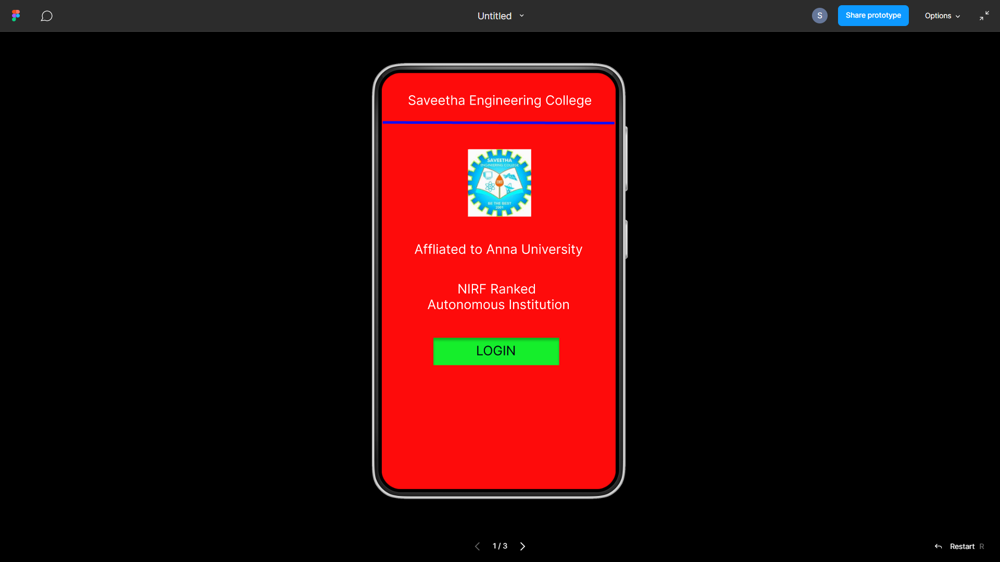
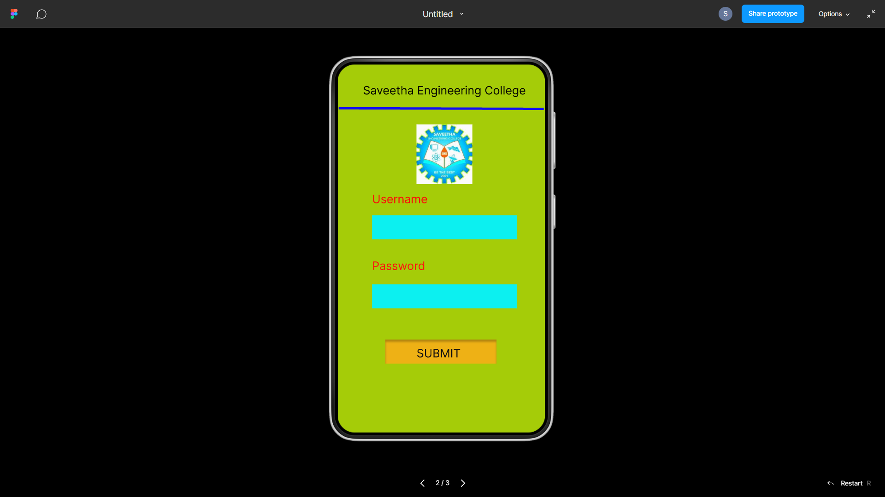
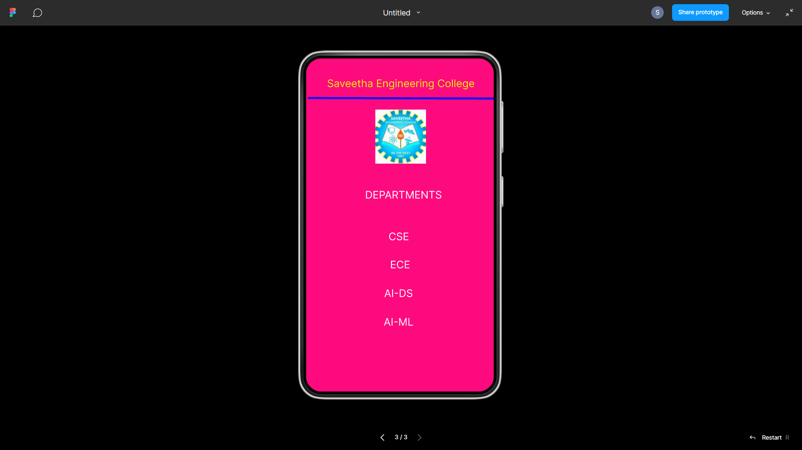

# Event Registration Web Application

## AIM:
To design, develop and deploy a web application for event registration.

## DESIGN STEPS:

### Step 1:
Create a new frame.

### Step 2:
Select any one preset size of your choice.

### Step 3:
Select the shapes you need.

### Step 4:
Import images as needed.

### Step 5:
Create pages based on your need and link them.

### Step 6:

Validate the HTML and CSS code.

### Step 6:

Publish the website in the given URL.

## DESIGN TOOL:
Figma

## CODE:
```
/* Home Page */


position: relative;
width: 360px;
height: 640px;

background: #FE0B0B;


/* Login Page */
position: relative;
width: 360px;
height: 640px;

background: #A5CC08;


/* WhatsApp Image 2023-01-27 at 2.32 3 */
position: absolute;
width: 97px;
height: 104px;
left: 133px;
top: 98px;

background: url(WhatsApp Image 2023-01-27 at 2.32.jpg);


/* Saveetha Engineering College */
position: absolute;
width: 340px;
height: 42px;
left: 12px;
top: 36px;

font-family: 'Inter';
font-style: normal;
font-weight: 400;
font-size: 20px;
line-height: 24px;
text-align: center;

color: #EFF404;

/* Line 4 */
position: absolute;
width: 356px;
height: 0px;
left: 4px;
top: 78px;

border: 4px solid #110CF4;
transform: rotate(0.16deg);


/* DEPARTMENTS */
position: absolute;
width: 324px;
height: 32px;
left: 25px;
top: 250px;

font-family: 'Inter';
font-style: normal;
font-weight: 400;
font-size: 20px;
line-height: 24px;
text-align: center;

color: #FFFFFF;

/* Text */
position: absolute;
width: 324px;
height: 35px;
left: 25px;
top: 272px;

font-family: 'Inter';
font-style: normal;
font-weight: 400;
font-size: 20px;
line-height: 24px;
text-align: center;

color: #FFFFFF;

/* CSE */
position: absolute;
width: 120px;
height: 26px;
left: 118px;
top: 330px;

font-family: 'Inter';
font-style: normal;
font-weight: 400;
font-size: 20px;
line-height: 24px;
text-align: center;

color: #FFFFFF;

/* ECE */
position: absolute;
width: 115px;
height: 32px;
left: 123px;
top: 384px;

font-family: 'Inter';
font-style: normal;
font-weight: 400;
font-size: 20px;
line-height: 24px;
text-align: center;

color: #FFFFFF;

/* AI-ML */
position: absolute;
width: 97px;
height: 31px;
left: 129px;
top: 494px;

font-family: 'Inter';
font-style: normal;
font-weight: 400;
font-size: 20px;
line-height: 24px;
text-align: center;

color: #FFFFFF;

/* AI-DS */
position: absolute;
width: 115px;
height: 32px;
left: 120px;
top: 439px;

font-family: 'Inter';
font-style: normal;
font-weight: 400;
font-size: 20px;
line-height: 24px;
text-align: center;

color: #FFFFFF;
```
## OUTPUT:




## RESULT:
The program to design, develop and deploy a web application for event registration is completed successfully.